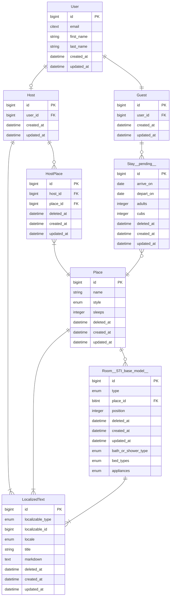

# BearBnB

An AirBnB clone for bears to demonstrate [Dream ORM](https://github.com/rvohealth/dream) and [Psychic web framework](https://github.com/rvohealth/psychic).

A good way to follow along with building a new Psychic app is:
1. Create a new Psychic app with `npx @rvoh/create-psychic bearbnb`.
2. Start with the second commit in this repo (`Generate User model`).
3. Then follow along with the changes. The commits are broken down into generated code and hand coded features.

Full guides available at [https://psychic-docs.netlify.app/docs/installation](https://psychic-docs.netlify.app/docs/installation).

## Running specs locally

Create file `.env.test` in the `api` directory:

```
DB_USER=<your PostgreSQL username>
DB_NAME=bearbnb_test
DB_PORT=5432
DB_HOST=localhost
APP_ENCRYPTION_KEY="RpCuTrH6fz+yKpxLJPUjsKoIlz+aHO79N5hI3o1oVSU="
TZ=UTC
```

Then:

```bash
yarn psy db:create
yarn psy db:migrate
yarn uspec spec/unit/models/
```

## State of the repo

Model layer mostly fleshed out. Run model specs with:
```bash
yarn uspec spec/unit/models/
```

Controllers have not been changed from their generated state, so will fail. Controllers will be updated in the near future.

The client apps (end user and admin) are merely the default apps generated by Vite. End-to-end feature specs will be added later to flesh out those apps.

## Entity Relationship Diagram (ERD) of the BearBnB model domain



## Generator commands used to create the models

```bash
yarn psy g:model User email:citext first_name:string last_name:string --no-serializer
yarn psy g:model Guest User:belongs_to
yarn psy g:model Host User:belongs_to
yarn psy g:resource v1/host/places Place name:citext style:enum:place_styles:cottage,cabin,lean_to,treehouse,tent,cave,dump sleeps:integer deleted_at:datetime
yarn psy g:model --no-serializer HostPlace Host:belongs_to Place:belongs_to deleted_at:datetime

yarn psy g:resource v1/host/places/rooms Room type:enum:room_types:Bathroom,Bedroom,Kitchen,Den,LivingRoom,Garage Place:belongs_to position:integer deleted_at:datetime

yarn psy g:sti-child --help
yarn psy g:sti-child Room/Bathroom extends Room bath_or_shower_type:enum:bath_or_shower_types:bath,shower,bath_and_shower,none
yarn psy g:sti-child Room/Bedroom extends Room bed_types:enum:bed_types:twin,bunk,queen,king,cot,sofabed
yarn psy g:sti-child Room/Kitchen extends Room appliances:enum:appliance_types:stove,oven,microwave,dishwasher
yarn psy g:sti-child Room/Den extends Room
yarn psy g:sti-child Room/LivingRoom extends Room
yarn psy g:resource v1/host/localized-texts LocalizedText localizable_type:enum:localized_types:Host,Place,Room localizable_id:bigint locale:enum:locales:en-US,es-ES title:string markdown:text deleted_at:datetime


# pending future work
yarn psy g:resource v1/guest/stays Stay Guest:belongs_to Place:belongs_to arrive_on:date depart_on:date adults:integer cubs:integer
yarn psy g:controller v1/guest/places index
```